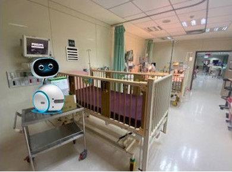
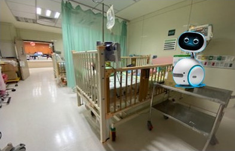
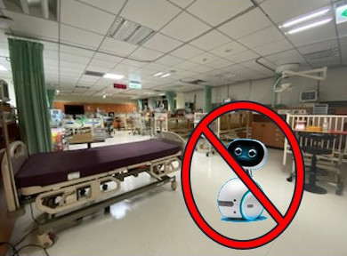
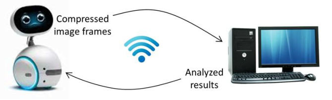

#### Introduction
This is a project for developing a companion robot to help nurses in a pediatric intensive care unit (PICU). There is a shortage of nurses in Taiwan, due to several factors such as low salaries, unsatisfying working environment, and the reduction of young working labors in the population structure caused by sub-replacement fertility.
In a PICU, children have to be separated from their parents for most time due to the sanity issue. In contrast, a companion robot can be totally sanitized and stay in the PICU. In practice, a PICU nurse usually needs to take care of multiple wards to make the operation economic. When a nurse is busy for one ward, she/he needs a helper to look after other wards. Currently such a duty is delegated to a nurse colleague, so there are multiple nurses on duty in a PICU.

#### Scenario

We plan to use the Asus Zenbo robots as our experimental vehicles and allocate them aside wards in a PICU. The Zenbo robots do not need to walk on the floor because there are many emergent events in which a robot on the floor may hinder nurses and doctors.

#### Goal
We want to develop a few features of the robot.
- Talk to the patient as a companion and reduce his/her stress and anxiety.
- Monitor the patient and notify the corresponding nurse in case when some events occur.

#### Technical Plan

Because Zenbo's computational power is weak, we plan to utilize Wi-Fi to transmit video and audio data to a server, which is powerful enough to take tasks of vision and voice recognition, and natural language processing. The robot will receive commands or analyzed results from the server and then interact with a child patient.