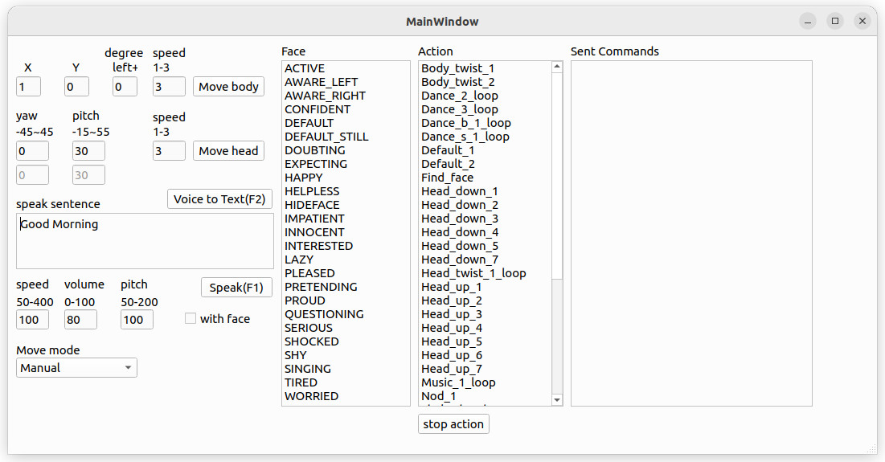
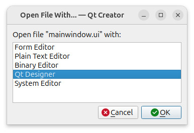

This folder contains the code files for the server side program of ZenboNurseHelper. It provides an Graphic User Interface (GUI) for a user to remotely control the robot's action. The GUI currently looks like the image below and allows a user to send commands to the robot-side's app, which calls Zenbo SDK to execute those commands.



In this project, we utilize Intel OpenVINO's human_pose_estimation_demo in their Open Model Zoo 2024 demos as a tool to guide our Zenbo robot. Our server-side program receives frames transmitted from the robot-side app, estimates human pose landmark coordinates, and reports the results to the robot-side program.

# OpenVINO Setting
Please download the Intel OpenVINO 2024.3's Ubuntu 24 archive. There are many ways to install OpenVINO [(Link)](https://www.intel.com/content/www/us/en/developer/tools/openvino-toolkit/download.html). For our case, we should use the archive file because it contains a setupvars.sh file, which is required by the open_model_zoo demo code.
```sh
cd ~
wget https://storage.openvinotoolkit.org/repositories/openvino/packages/2024.3/linux/l_openvino_toolkit_ubuntu24_2024.3.0.16041.1e3b88e4e3f_x86_64.tgz
```
Unzip the file
```sh
tar -xvzf l_openvino_toolkit_ubuntu24_2024.3.0.16041.1e3b88e4e3f_x86_64.tgz
```
Create a symbolic link
```sh
ln -s l_openvino_toolkit_ubuntu24_2024.3.0.16041.1e3b88e4e3f_x86_64 OpenVINO
```
Delete the downloaded file
```sh
rm l_openvino_toolkit_ubuntu24_2024.3.0.16041.1e3b88e4e3f_x86_64.tgz
```
We need to instal the git program because we are going to download source files from GitHub.
```sh
sudo apt -y install git
```
After installing git, you can download open_model_zoo files from GitHub.
```sh
cd ~
git clone --recurse-submodules https://github.com/openvinotoolkit/open_model_zoo.git
```
We need a pretrained model human-pose-estimation-0001.xml and its bin file used in the human_pose_estimation_demo, which is a part of the OpenPose algorithm.
To download the model, we use a Python tool package omz_tools, whose installation instruction is a part of the open_model_zoo. See [(Link)](https://github.com/openvinotoolkit/open_model_zoo/blob/master/tools/model_tools/README.md).
However, the instruction does not fully work on Ubuntu 24.04, which prevents system-wide Python package installation. Our solution is to install a Debian packaged Python application by
```sh
sudo apt -y install python3-pip
```
This command also installs the setuptools package, which is equivalent to the open_model_zoo's installation instruction "pip install setuptools".
Thereafter, we install the the openvino-dev package. Because Ubuntu 24.04 prevent system-wide Python package installation, we need to modify Intel's instruction by replacing "pip install openvino-dev" to
```sh
pip install openvino-dev --break-system-packages
```
Navigate to the open_model_zoo/tools/model_tools directory, and install the omz_tools package
```sh
cd ~/open_model_zoo/tools/model_tools
pip install . --break-system-packages
```
After installing the model_tools package, we use this command to download the human-pose-estimation models from a file server.
```sh
python3 ~/open_model_zoo/tools/model_tools/src/omz_tools/omz_downloader.py --list ~/open_model_zoo/demos/human_pose_estimation_demo/cpp/models.lst -o ~/open_model_zoo/models
```
It will download 23 files saved in ~/open_model_zoo/models/intel and ~/open_model_zoo/models/public although we only need 2 of them. However, this command is better than the Intel's instruction "omz_downloader --all" because it will download a lot of files and take a long time.

# Install Our Files
Suppose your Open Model Zoo is installed in ~/open_model_zoo.
Please git clone this repository into the demos directory.
```sh
cd ~/open_model_zoo/demos
git clone https://github.com/yangchihyuan/ZenboNurseHelper.git
```

# Install Dependencies
## Protocol Buffer 
We use this tool to pass messages from our server program to the Android app.
```sh
sudo apt -y install protobuf-compiler
```
It will install Protocol Buffer version 3.21.12-8.2.

## OpenCV
It is required by the open_model_zoo's human_pose_estimation demo, and we use it to show images captured by the Zenbo robot's camera.
```sh
sudo apt -y install libopencv-dev
```
It will install OpenCV version 4.6.0.

## libgflags
It is a tool library to help us parse command arguments
```sh
sudo apt -y install libgflags-dev
```
It will install libgflags 2.2.2-2.

## Qt 
We use it to create our GUI
```sh
sudo apt -y install qt6-base-dev
sudo apt -y install qt6-multimedia-dev
```
It will install Qt version 6.4.2.

### Hint
The two commands to install Qt base and multimedia libraries allow you to compile this project. However, they do not isntall Qt Designer, a convenient tool to the GUI file mainwindow.ui. If you want to install Qt Designer, you need to use this command
```sh
sudo apt -y install qtcreator
```
The Qt creator takes more than 1G disk space because it requires many libraries. Once installed, you can launch the program to open the mainwindow.ui file with Qt Designer.



## PortAudio 
We use it to play voice on the server transmitted from the Android app and received from the robot's microphone.
There is no package made for the Ubuntu system, and we need to compile it from downloaded source files, which are available on its GitHub page
```sh
cd ~
git clone https://github.com/PortAudio/portaudio.git
```
There is an instruction page teaching how to compile and install PortAudio [(Link)](https://www.portaudio.com/docs/v19-doxydocs/compile_linux.html)
However, as the page claims it is not reviewed, we modified its commands to
```sh
sudo apt-get -y install libasound2-dev
cd ~/portaudio
./configure
make
sudo make install
```

## whisper.cpp
It is voice-to-text library and we utilize it on our server-side program to quickly generate sentences spoken by an operator, which will be sent to the Zenbo robot to speak out.
There is no package make for the Ubuntu system, and we need to compile it from it source file downloaded from its GitHub repository
```sh
cd ~
git clone https://github.com/ggerganov/whisper.cpp.git
```
We need a Whisper model. In out program, we use the base model for Mandarin.
```sh
cd ~/whisper.cpp
bash ./models/download-ggml-model.sh base
```
It will download ggml-base.bin from the HuggingFace website.
We need its compiled .o files, which will be used in our server-side program.
```sh
make
```
Because whisper.cpp runs slowly if it only uses CPUs, we need a GPU to accelerate its computation. In our case, Ubuntu desktop 24.04 installs the NVidia-driver 535 by default. It is not the latest one, but still works.

# Compile and Run
We need CMake to build open_model_zoo projects.
```sh
sudo apt -y install cmake
```
Run the OpenVINO's build_demos.sh in ~/open_model_zoo/demos to build this project, and an executable file 9_NurseHelper should be created at ~/omz_demos_build/intel64/Release/
To make it easy, we make s build_demos.sh in the directory ~/open_model_zoo/demos/ZenboNurseHelper/cpp
```sh
cd ~/open_model_zoo/demos/ZenboNurseHelper/cpp
./build_demo.sh
```
This command will compile all open_model_zoo's demos, including our ZenboNurseHelper. After make the execute file 9_NurseHelper, execute the command to launch it.
```sh
./run_server_side_program.sh
```
The program easily crashes because we use several libraries containing bugs. To detect those bugs, use this command
```sh
./run_server_side_program.sh debug
```
which use gdb for debugging.

# Known problems and workarounds
## Qt FreeType crash problem
Our program often crashes in this function FT_Load_Glyph () at /lib/x86_64-linux-gnu/libfreetype.so.6, which is called by QFontEngineFT::loadGlyph(QFontEngineFT::QGlyphSet*, unsigned int, QFixedPoint const&, QFontEngine::GlyphFormat, bool, bool) const () at /home/chihyuan/Qt/6.7.2/gcc_64/lib/libQt6Gui.so.6. According to two blogs [(Link1)](https://stackoverflow.com/questions/40490414/cannot-trace-cause-of-crash-in-qt-program) [(Link2)](https://blog.csdn.net/weixin_41797797/article/details/105861978), it is a Qt bug only occurring on Linux. To avoid this problem, use the command in the terminal window before launching our program.

